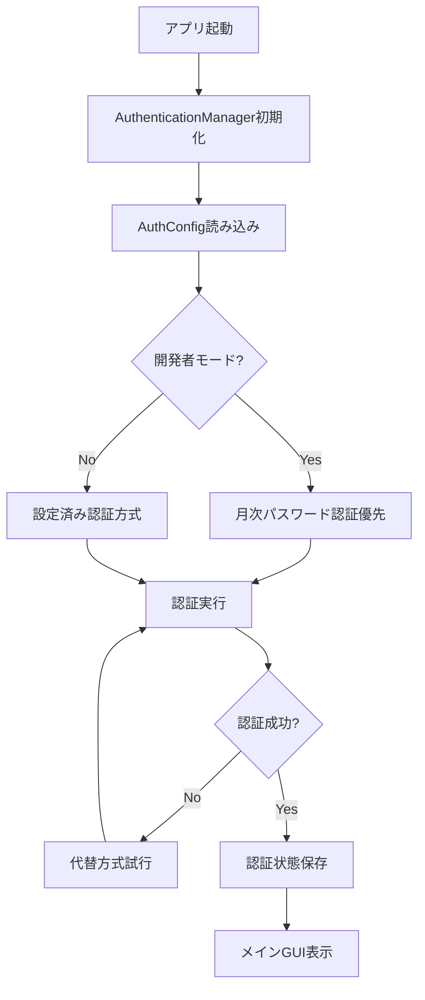
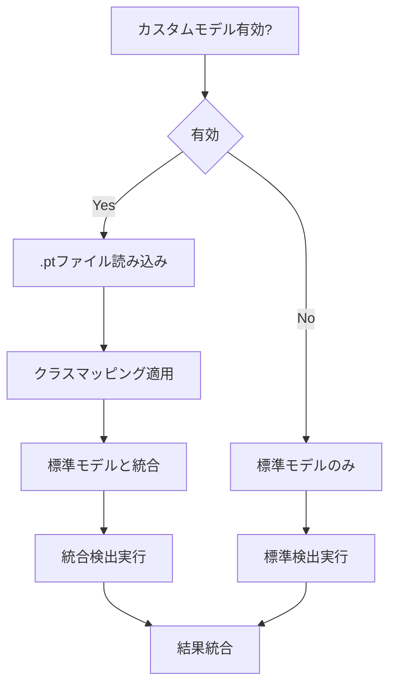
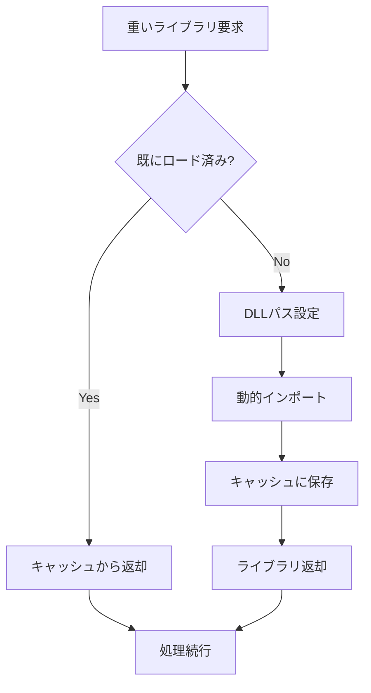

# 自動モザエセ v1.0 - API ドキュメント

## 📋 概要

自動モザエセ v1.0は、アニメ・イラスト画像の男女局部を自動検出してモザイク処理を適用するツールです。YOLO検出 + SAM分割の高精度処理により、自然な仕上がりを実現し、FANZA基準対応の安全なモザイク処理を提供します。

### 🆕 v1.0の主要機能
- **統合認証システム**: 月次パスワード + Discord認証の統一管理
- **カスタムモデル対応**: 任意のYOLO形式.ptファイルをカスタム検出器として追加可能
- **遅延ローダー**: exe化時のファイルサイズ削減とパフォーマンス向上
- **暗号化設定管理**: 配布版での認証情報安全管理
- **柔軟なモデル検索**: 複数場所からのモデルファイル自動検出

## 🏗️ アーキテクチャ

```
auto_mosaic/
├── __main__.py          # メインエントリーポイント
├── __init__.py          # パッケージ初期化
└── src/
    ├── __init__.py      # srcパッケージ初期化
    ├── gui.py           # GUIアプリケーション（メイン）
    ├── detector.py      # YOLO検出エンジン
    ├── segmenter.py     # SAMセグメンテーション
    ├── mosaic.py        # モザイク処理エンジン
    ├── downloader.py    # モデルダウンローダー
    ├── utils.py         # ユーティリティ関数
    ├── nudenet_detector.py  # NudeNet検出器
    │
    │ === 統合認証システム ===
    ├── auth_manager.py      # 統合認証マネージャー（新）
    ├── auth_config.py       # 認証設定管理（新）
    ├── auth.py              # 月次パスワード認証（従来）
    ├── discord_auth_adapter.py  # Discord認証アダプター（新）
    │
    │ === 設定・環境管理 ===
    ├── env_config.py        # 環境変数設定管理（新）
    ├── encrypted_config.py  # 暗号化設定管理（新）
    └── lazy_loader.py       # 遅延ローダー（新）
```

---

## 📁 ファイル別詳細ドキュメント

### 🚀 1. `__main__.py` - メインエントリーポイント

**目的**: アプリケーションのメインエントリーポイント

```python
def main():
    """Main entry point for 自動モザエセ"""
```

**主要機能**:
- GUIアプリケーションの起動
- 依存関係の確認
- エラーハンドリング

**使用方法**:
```bash
python -m auto_mosaic
```

---

### 🎛️ 2. `__init__.py` - パッケージ初期化

**目的**: パッケージの初期化とPyTorch互換性の設定

**主要機能**:
- Python 3.10+の要件チェック
- PyTorchのweights_only警告の無効化
- グローバルtorch.loadのパッチ適用

**重要な設定**:
```python
# PyTorch互換性設定
os.environ["PYTORCH_WEIGHTS_ONLY"] = "false"
torch.serialization._weights_only_pickle_default = False
```

---

### 🖼️ 3. `gui.py` - GUIアプリケーション

**目的**: メインのグラフィカルユーザーインターフェース

#### 主要クラス

##### `FirstRunSetupDialog`
初回起動時のセットアップダイアログ

**メソッド**:
- `__init__(parent)`: ダイアログ初期化
- `_create_dialog()`: ダイアログUI作成
- `_open_models_folder()`: modelsフォルダを開く
- `_complete_setup()`: セットアップ完了処理
- `show()`: ダイアログ表示

##### `AutoMosaicGUI`
メインGUIアプリケーション

**初期化**:
```python
def __init__(self):
    """Initialize GUI application"""
```

**主要メソッド**:

###### ファイル管理
- `_add_images()`: 画像ファイル追加
- `_add_folder()`: フォルダから画像追加
- `_clear_images()`: 画像リストクリア
- `_select_output_folder()`: 出力フォルダ選択

###### 処理制御
- `_start_processing()`: 処理開始
- `_stop_processing()`: 処理停止
- `_process_images()`: 画像処理メイン
- `_process_single_image()`: 単一画像処理

###### モデル管理
- `_initialize_models()`: モデル初期化
- `_setup_model_settings()`: モデル設定UI
- `_update_model_checkboxes_display()`: モデル選択表示更新

###### カスタムモデル管理（新機能）
- `_add_custom_model()`: カスタムモデル追加
- `_edit_custom_model()`: カスタムモデル編集
- `_remove_custom_model()`: カスタムモデル削除
- `_batch_manage_custom_models()`: カスタムモデル一括管理
- `_show_custom_model_dialog()`: カスタムモデル設定ダイアログ

###### 認証管理（新機能）
- `_show_auth_method_selection()`: 認証方式選択
- `_force_authentication()`: 強制認証
- `_clear_authentication()`: 認証クリア

###### 設定UI構築
- `_setup_basic_settings()`: 基本設定UI
- `_setup_mosaic_settings()`: モザイク設定UI
- `_setup_detector_settings()`: 検出器設定UI
- `_setup_custom_model_settings_content()`: カスタムモデル設定UI
- `_setup_filename_settings_content()`: ファイル名設定UI

**新設定項目**:
- カスタムモデル使用 (任意の.ptファイル対応)
- 認証方式選択 (開発者モード時)
- 検出器モード (anime_only/nudenet_only/hybrid)
- マスク方式選択 (contour/rectangle)
- 個別拡張設定 (部位別拡張ピクセル数)

---

### 🔐 4. `auth_manager.py` - 統合認証マネージャー（新機能）

**目的**: 複数の認証方式を統一インターフェースで管理

#### 主要クラス

##### `AuthenticationManager`
統合認証システムの中核

**初期化**:
```python
def __init__(self):
    self.auth_config = AuthConfig()
    self.discord_auth = DiscordAuthAdapter()
    self.monthly_auth = MonthlyAuth()
```

**主要メソッド**:
- `authenticate(parent, force_dialog)`: 統合認証実行
- `is_authenticated()`: 現在の認証状態確認
- `clear_authentication()`: 認証情報クリア
- `get_current_auth_method()`: 現在の認証方式取得
- `set_auth_method(method)`: 認証方式設定

**認証フロー**:
1. 設定済み認証方式の確認
2. 方式に応じた認証実行
3. 失敗時の代替方式試行
4. 認証状態の永続化

##### `AuthMethodSelectionDialog`
認証方式選択ダイアログ

**対応認証方式**:
- `MONTHLY_PASSWORD`: 月次パスワード認証
- `DISCORD`: Discord OAuth2認証

---

### ⚙️ 5. `auth_config.py` - 認証設定管理（新機能）

**目的**: 認証方式の設定保存・読み込み管理

#### 主要クラス

##### `AuthMethod` (Enum)
```python
class AuthMethod(Enum):
    MONTHLY_PASSWORD = "monthly_password"
    DISCORD = "discord"
```

##### `AuthConfig`
認証設定の一元管理

**主要メソッド**:
- `is_developer_mode()`: 開発者モード判定
- `is_auth_method_switching_available()`: 認証方式切り替え可能判定
- `get_auth_method()`: 現在の認証方式取得
- `set_auth_method(method)`: 認証方式設定
- `ensure_developer_mode_settings()`: 開発者モード設定自動適用

**開発者モード判定**:
```python
# .envファイルのDEVELOPER_MODE設定を使用
DEVELOPER_MODE=true  # 開発者モード有効
```

---

### 🎮 6. `discord_auth_adapter.py` - Discord認証アダプター（新機能）

**目的**: Discord OAuth2認証の実装

#### 主要クラス

##### `DiscordTokenManager`
Discordトークンの管理

**機能**:
- アクセストークンの保存・読み込み
- 7日間の有効期限管理
- トークン自動更新

##### `DiscordAuthAdapter`
Discord認証の実行

**OAuth2設定**:
```python
self.DISCORD_CLIENT_ID = "your_client_id"
self.DISCORD_CLIENT_SECRET = "your_client_secret"
self.DISCORD_REDIRECT_URI = "http://localhost:8000/callback"
self.DISCORD_SCOPES = ["identify", "guilds", "guilds.members.read"]
```

**複数サーバー対応**:
```python
self.GUILD_CONFIGS = [
    {
        "guild_id": "server_id_1",
        "name": "承認済みサーバー1",
        "required_roles": ["premium_member", "vip"]
    },
    # 複数サーバー設定可能
]
```

**主要メソッド**:
- `authenticate()`: Discord認証実行
- `is_authenticated()`: 認証状態確認
- `clear_authentication()`: 認証クリア
- `_check_user_roles()`: ユーザーロール確認

---

### 🔧 7. `env_config.py` - 環境変数設定管理（新機能）

**目的**: .envファイルからの設定読み込みとフォールバック機能

#### 主要クラス

##### `EnvironmentConfig`
環境変数設定管理

**対応設定**:
```env
# .env ファイル例
DEVELOPER_MODE=true
MONTHLY_PASSWORD_2025_01=hashed_password_value
MASTER_PASSWORD=hashed_master_password
DISCORD_CLIENT_ID=your_discord_client_id
DISCORD_CLIENT_SECRET=your_discord_client_secret
```

**主要メソッド**:
- `is_developer_mode()`: 開発者モード判定
- `get_monthly_passwords()`: 月次パスワード一覧取得
- `get_master_password_hash()`: マスターパスワードハッシュ取得
- `validate_env_file()`: .envファイル検証

---

### 🔒 8. `encrypted_config.py` - 暗号化設定管理（新機能）

**目的**: 配布版での認証情報安全管理

#### 主要クラス

##### `EncryptedConfigManager`
暗号化された設定ファイル管理

**暗号化仕様**:
- AES暗号化（Fernet）
- PBKDF2によるキー導出
- ソルトファイル分離管理

**設定ファイル配置**:
```
%APPDATA%\自動モザエセ\config\
├── auth.dat          # 暗号化設定ファイル
└── auth.salt         # ソルトファイル
```

##### `DistributionConfigLoader`
配布版設定ローダー

**対応設定**:
- 月次パスワード一覧
- Discord OAuth2設定
- 配布版固有設定

**主要メソッド**:
- `load_discord_config()`: Discord設定読み込み
- `create_encrypted_config()`: 暗号化設定作成
- `decrypt_config()`: 設定復号化

---

### ⚡ 9. `lazy_loader.py` - 遅延ローダー（新機能）

**目的**: 重いライブラリの遅延ロードによるパフォーマンス向上

#### 主要クラス

##### `LazyLoader`
遅延ローディングシステム

**対象ライブラリ**:
- PyTorch (torch)
- Ultralytics YOLO
- Segment Anything Model
- NudeNet
- OpenCV重い機能

**最適化機能**:
- DLLパス自動設定
- CUDA環境変数管理
- スレッドセーフな遅延ロード
- メモリ使用量最適化

**主要メソッド**:
- `load_module(name)`: モジュール遅延ロード
- `_setup_dll_path()`: DLLパス設定
- `_get_cuda_dll_path()`: CUDA DLLパス取得

**CUDA最適化**:
```python
# exe化時のCUDA DLL配置
exe_dir/
├── cuda_libs/          # CUDA専用DLL
├── external_libs/      # 一般ライブラリ
└── 自動モザエセ.exe
```

---

### 🎯 10. `detector.py` - YOLO検出エンジン（更新）

**目的**: YOLO-basedの局部検出システム

#### 主要クラス

##### `MultiModelDetector`（更新）
複数専用モデル + カスタムモデル検出器

**カスタムモデル対応**:
```python
def _load_custom_models(self):
    """カスタムモデルを読み込む"""
    for model_name, model_config in self.config.custom_models.items():
        if model_config.get('enabled', False):
            model_path = Path(model_config.get('path', ''))
            # カスタムYOLOモデルを動的ロード
```

**クラスマッピング**:
```python
# カスタムモデルのクラスマッピング例
custom_class_mappings = {
    "custom_anime_model": {
        0: "penis",
        1: "vagina", 
        2: "anus",
        3: "nipples"
    }
}
```

**検出モード**:
- `anime_only`: イラスト専用モデルのみ
- `nudenet_only`: NudeNet（実写）のみ  
- `hybrid`: ハイブリッド検出（推奨）
- `custom`: カスタムモデル使用

**柔軟なモデル検索**:
```python
def find_model_files_in_search_paths(self, model_name: str):
    """複数場所からモデルファイルを検索"""
    search_dirs = [
        self.models_dir,                    # 標準modelsディレクトリ
        exe_dir,                           # exe実行ディレクトリ
        project_root,                      # プロジェクトルート
        exe_dir / "models",                # exe/models
        project_root / "anime_nsfw_v4"     # プロジェクト/anime_nsfw_v4
    ]
```

---

### 📥 11. `downloader.py` - モデルダウンローダー（更新）

**目的**: MLモデルファイルの自動ダウンロードとキャッシュ管理

**CivitAI API連携**:
```python
def set_civitai_api_key(self, api_key: str):
    """CivitAI APIキーを設定"""
    self.civitai_api_key = api_key
```

**スマートセットアップ**:
```python
def smart_model_setup(self, progress_callback):
    """自動・手動ダウンロードの組み合わせ"""
    # 自動ダウンロード可能 → 自動実行
    # 手動ダウンロード必要 → ブラウザで開く
```

**配布版対応**:
- exe内埋め込みモデル検出
- 外部配置モデル優先読み込み
- フォールバック検索機能

---

### 🔧 12. `utils.py` - ユーティリティ関数（更新）

#### 主要クラス

##### `ProcessingConfig`（更新）
処理設定の一元管理

**新設定項目**:
```python
# カスタムモデル設定
self.use_custom_models = False
self.custom_models = {}  # {"name": {"path": "", "enabled": True, "class_mapping": {}}}

# 検出器選択設定  
self.detector_mode = "hybrid"        # anime_only/nudenet_only/hybrid
self.use_anime_detector = True
self.use_nudenet = True

# マスク方式選択
self.sam_use_vit_b = True           # 輪郭マスク（高精度）
self.sam_use_none = False           # 矩形マスク（高速）

# 個別拡張設定
self.use_individual_expansion = False
self.individual_expansions = {
    "penis": 15,
    "labia_minora": 15,
    "testicles": 15,
    # 部位別に個別設定可能
}
```

**開発者モード判定**:
```python
def is_developer_mode() -> bool:
    """開発者モード判定（統一化）"""
    try:
        from auto_mosaic.src.env_config import get_env_config
        env_config = get_env_config()
        return env_config.is_developer_mode()
    except Exception:
        return False
```

---

## 🔄 処理フロー

### 統合認証フロー



### カスタムモデル処理フロー



### 遅延ローダーフロー



---

## 🎯 API使用例

### 統合認証システムの使用例

```python
from auto_mosaic.src.auth_manager import AuthenticationManager, AuthMethod

# 認証マネージャー初期化
auth_manager = AuthenticationManager()

# 認証実行
if auth_manager.authenticate():
    print("認証成功")
    
    # 現在の認証方式確認
    current_method = auth_manager.get_current_auth_method()
    print(f"認証方式: {current_method.value}")
else:
    print("認証失敗")

# 認証方式切り替え（開発者モード時のみ）
auth_manager.set_auth_method(AuthMethod.DISCORD)
```

### カスタムモデルの使用例

```python
from auto_mosaic.src.utils import ProcessingConfig
from auto_mosaic.src.detector import MultiModelDetector

# カスタムモデル設定
config = ProcessingConfig()
config.use_custom_models = True
config.custom_models = {
    "my_anime_model": {
        "path": "/path/to/my_model.pt",
        "enabled": True,
        "class_mapping": {
            0: "penis",
            1: "vagina",
            2: "anus"
        }
    }
}

# 検出器初期化（カスタムモデル含む）
detector = MultiModelDetector(config=config)

# 検出実行
bboxes_with_class = detector.detect(image, conf=0.25, config=config)

# 結果にはカスタムモデルの検出結果も含まれる
for x1, y1, x2, y2, class_name, source in bboxes_with_class:
    print(f"検出: {class_name} (ソース: {source})")
    # source: 'IL'=イラスト専用, 'PH'=NudeNet, 'CU'=カスタム
```

### 環境設定管理の使用例

```python
from auto_mosaic.src.env_config import get_env_config

# 環境設定取得
env_config = get_env_config()

# 開発者モード判定
if env_config.is_developer_mode():
    print("開発者モードで実行中")
    
    # 月次パスワード取得
    monthly_passwords = env_config.get_monthly_passwords()
    print(f"設定済み月数: {len(monthly_passwords)}")

# .envファイル検証
validation_results = env_config.validate_env_file()
for key, message in validation_results.items():
    print(f"{key}: {message}")
```

### 遅延ローダーの使用例

```python
from auto_mosaic.src.lazy_loader import LazyLoader

# 遅延ローダー初期化
loader = LazyLoader()

# 重いライブラリを必要時にロード
torch = loader.load_module('torch')
ultralytics = loader.load_module('ultralytics')

# 初回ロード時のみ時間がかかり、2回目以降は高速
yolo_model = ultralytics.YOLO('model.pt')
```

---

## 🔧 設定リファレンス

### ProcessingConfig設定項目（更新）

| 項目 | 型 | デフォルト | 説明 |
|------|----|-----------|----|
| `use_custom_models` | bool | False | カスタムモデル使用 |
| `custom_models` | dict | {} | カスタムモデル設定 |
| `detector_mode` | str | "hybrid" | 検出器モード |
| `use_anime_detector` | bool | True | イラスト専用モデル使用 |
| `use_nudenet` | bool | True | 実写専用モデル使用 |
| `sam_use_vit_b` | bool | True | SAM ViT-B使用（輪郭） |
| `sam_use_none` | bool | False | SAMなし（矩形） |
| `use_individual_expansion` | bool | False | 個別拡張使用 |
| `individual_expansions` | dict | {...} | 部位別拡張設定 |

### 認証設定項目（新機能）

| 項目 | 型 | デフォルト | 説明 |
|------|----|-----------|----|
| `auth_method` | str | "monthly_password" | 認証方式 |
| `allow_method_switching` | bool | True | 方式切り替え許可 |
| `last_successful_method` | str | None | 最後に成功した方式 |

### 環境変数設定項目（新機能）

| 環境変数 | 型 | 説明 | 例 |
|----------|----|----- |---|
| `DEVELOPER_MODE` | bool | 開発者モード | true |
| `MONTHLY_PASSWORD_2025_01` | str | 月次パスワード | ハッシュ値 |
| `MASTER_PASSWORD` | str | マスターパスワード | ハッシュ値 |
| `DISCORD_CLIENT_ID` | str | DiscordクライアントID | 123456789 |
| `DISCORD_CLIENT_SECRET` | str | Discordクライアントシークレット | secret |

---

## 🚨 エラーハンドリング

### 新しいエラーと対処法

| エラー | 原因 | 対処法 |
|-------|------|--------|
| `Custom model file not found` | カスタムモデルファイル未配置 | ファイルパス確認・再設定 |
| `Discord authentication failed` | Discord認証エラー | クライアント設定確認 |
| `Developer mode required` | 開発者機能へのアクセス | .env設定確認 |
| `Encrypted config decryption failed` | 暗号化設定読み込み失敗 | auth.datファイル確認 |
| `Lazy loading failed` | 遅延ローダーエラー | DLLパス・依存関係確認 |

### ログ出力例（更新）

```
2025-01-XX XX:XX:XX - auto_mosaic - INFO - [AUTH] Integrated authentication started
2025-01-XX XX:XX:XX - auto_mosaic - INFO - [AUTH] Using monthly password method
2025-01-XX XX:XX:XX - auto_mosaic - INFO - [CUSTOM] Loading custom model 'my_anime_model'
2025-01-XX XX:XX:XX - auto_mosaic - INFO - [DETECTOR] Hybrid detection: anime=True, nudenet=True
2025-01-XX XX:XX:XX - auto_mosaic - INFO - [LAZY] Torch loaded with CUDA support
```

---

## 📝 バージョン情報

- **Version**: 1.2.0
- **Author**: Auto Mosaic Development Team  
- **License**: Proprietary
- **Python**: 3.10+
- **Dependencies**: PyTorch, OpenCV, NumPy, tkinter, ultralytics, segment-anything, cryptography, python-dotenv

### 互換性情報
- v1.0設定ファイルとの後方互換性あり
- カスタムモデル機能は新規追加
- 認証システムは統合されたが従来方式も利用可能

---

## 🔗 関連リンク

- [Anime NSFW Detection v4.0](https://civitai.com/models/1313556?modelVersionId=1863248) - CivitAI
- [Segment Anything Model](https://github.com/facebookresearch/segment-anything) - Meta AI
- [YOLOv8](https://github.com/ultralytics/ultralytics) - Ultralytics
- [NudeNet](https://github.com/notAI-tech/NudeNet) - notAI-tech
- [Discord Developer Portal](https://discord.com/developers/applications) - OAuth2設定用

このドキュメントは自動モザエセ v1.0の開発・保守・拡張に必要な全ての技術的詳細を提供します。 