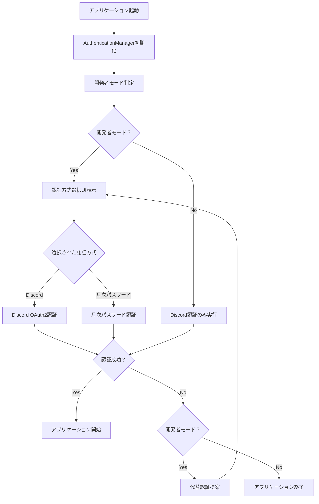

# 自動モザエセ - コード構成・アーキテクチャドキュメント v3.0

## 📋 概要

自動モザエセは、AI技術を活用した自動モザイク処理ツールです。このドキュメントでは、プロジェクトのコード構成、アーキテクチャ設計、および各コンポーネントの役割について詳述します。

### 🎯 アーキテクチャの特徴
- **モジュラー設計**: 機能別に分離された独立性の高いモジュール構成
- **統合認証システム**: Discord認証と月次パスワード認証の統合インターフェース
- **マルチモデル対応**: YOLOv8、NudeNet、SAMの複数AI技術を統合
- **開発者モード制御**: 配布版と開発版の動的機能切り替え

---

## 🏗️ 全体アーキテクチャ

### システム構成図

```
┌─────────────────────────────────────────────────────────────┐
│                      自動モザエセ v3.0                        │
├─────────────────────────────────────────────────────────────┤
│ 🖥️ プレゼンテーション層                                      │
│  ├── GUI (gui.py)                                           │
│  ├── 統合認証UI (auth_manager.py)                           │
│  └── 設定ダイアログ (各種設定UI)                              │
├─────────────────────────────────────────────────────────────┤
│ 🔐 認証・セキュリティ層                                       │
│  ├── 統合認証マネージャー (auth_manager.py)                  │
│  ├── Discord認証アダプター (discord_auth_adapter.py)        │
│  ├── 月次パスワード認証 (auth.py)                             │
│  ├── 認証設定管理 (auth_config.py)                          │
│  └── 暗号化設定 (encrypted_config.py)                       │
├─────────────────────────────────────────────────────────────┤
│ 🧠 AI処理層                                                 │
│  ├── マルチモデル検出器 (detector.py)                        │
│  ├── NudeNet検出器 (nudenet_detector.py)                   │
│  ├── SAMセグメンテーション (segmenter.py)                   │
│  └── モザイク処理エンジン (mosaic.py)                        │
├─────────────────────────────────────────────────────────────┤
│ 📦 サポート・ユーティリティ層                                 │
│  ├── モデルダウンローダー (downloader.py)                    │
│  ├── 遅延読み込みシステム (lazy_loader.py)                  │
│  ├── 共通ユーティリティ (utils.py)                           │
│  └── 環境設定管理 (env_config.py)                           │
└─────────────────────────────────────────────────────────────┘
```

### データフロー

```
┌──────────┐    ┌──────────┐    ┌──────────┐    ┌──────────┐
│  画像入力  │ → │ AI検出処理 │ → │セグメンテー│ → │モザイク適用│
└──────────┘    └──────────┘    │ション処理  │    └──────────┘
                                └──────────┘
      ↓                              ↓              ↓
┌──────────┐    ┌──────────┐    ┌──────────┐    ┌──────────┐
│  認証確認  │    │ モデル選択 │    │ マスク生成 │    │ 出力保存  │
└──────────┘    └──────────┘    └──────────┘    └──────────┘
```

---

## 📁 ディレクトリ構造詳細

```
auto_mosaic/
├── auto_mosaic/                    # メインアプリケーションパッケージ
│   ├── __init__.py                 # パッケージ初期化、PyTorch設定
│   ├── __main__.py                 # アプリケーションエントリーポイント
│   └── src/                        # ソースコードディレクトリ
│       ├── __init__.py             # srcパッケージ初期化
│       │
│       # 🔐 認証・セキュリティシステム
│       ├── auth_config.py          # 統合認証設定管理（中核）
│       ├── auth_manager.py         # 統合認証マネージャー
│       ├── auth.py                 # 月次パスワード認証（レガシー互換）
│       ├── discord_auth_adapter.py # Discord OAuth2認証アダプター
│       ├── encrypted_config.py     # 暗号化設定ファイル管理
│       ├── env_config.py           # 環境変数・設定管理
│       │
│       # 🧠 AI・画像処理システム
│       ├── detector.py             # マルチモデル検出システム
│       ├── nudenet_detector.py     # NudeNet専用検出器
│       ├── segmenter.py            # SAMセグメンテーションシステム
│       ├── mosaic.py               # モザイク処理エンジン
│       │
│       # 🖥️ ユーザーインターフェース
│       ├── gui.py                  # メインGUIアプリケーション
│       │
│       # 📦 サポートシステム
│       ├── downloader.py           # モデルファイルダウンローダー
│       ├── lazy_loader.py          # 遅延読み込みシステム
│       └── utils.py                # 共通ユーティリティ関数
│
├── config/                         # 設定・認証データ
│   ├── auth.dat                    # 暗号化認証データ
│   ├── auth.salt                   # 暗号化ソルト
│   └── discord_auth/               # Discord認証データ
│
├── models/                         # AIモデルファイル
│   └── anime_nsfw_v4/              # Anime NSFW Detection v4.0
│
├── nudenet_models/                 # NudeNetモデル
│
└── logs/                          # ログファイル
```

---

## 🔐 認証・セキュリティシステム

### 統合認証アーキテクチャ

```python
# 認証システムの階層構造
AuthenticationManager (auth_manager.py)
├── AuthConfig (auth_config.py)           # 設定・制御ロジック
├── DiscordAuthAdapter (discord_auth_adapter.py)  # Discord OAuth2
├── MonthlyAuth (auth.py)                 # 月次パスワード認証
└── EncryptedConfigManager (encrypted_config.py)  # 暗号化設定
```

### 🔐 暗号化設定システム

#### 技術仕様

**暗号化アルゴリズム**:
- **暗号方式**: Fernet (AES 128 in CBC mode + HMAC authentication)
- **キー導出**: PBKDF2-HMAC-SHA256 (100,000 iterations)
- **ソルト**: 16バイトランダム生成
- **マスターキー**: `AUTO_MOSAIC_DIST_2025` (ソースコード埋め込み)

**ファイル構成**:
```
config/
├── auth.dat      # 暗号化されたDiscord認証データ (JSON)
└── auth.salt     # PBKDF2用ソルト (16 bytes)
```

#### 暗号化データ構造

```python
# auth.dat 内部構造 (復号化後のJSON)
{
    "client_id": "YOUR_DISCORD_CLIENT_ID",
    "client_secret": "YOUR_DISCORD_CLIENT_SECRET",
    "guilds": [
        {
            "guild_id": "GUILD_ID_1",
            "name": "サーバー名1",
            "required_roles": ["ROLE_ID_1", "ROLE_ID_2"]
        },
        {
            "guild_id": "GUILD_ID_2",
            "name": "サーバー名2", 
            "required_roles": ["ROLE_ID_3"]
        }
    ],
    "redirect_uri": "http://localhost:8000/callback",
    "scopes": ["identify", "guilds", "guilds.members.read"],
    "max_failures": 3,
    "cooldown": 10
}
```

#### 配布用設定作成手順

**1. 開発環境での設定作成**:
```bash
# .envファイルにDiscord認証情報を設定
DEVELOPER_MODE=true
DISCORD_CLIENT_ID=YOUR_DISCORD_CLIENT_ID
DISCORD_CLIENT_SECRET=YOUR_DISCORD_CLIENT_SECRET
# ... その他の設定

# 暗号化ファイル生成
python create_distribution_config.py
```

**2. 自動実行される処理**:
```python
# encrypted_config.py での自動処理
def create_distribution_config(discord_config):
    """配布用暗号化設定作成"""
    # 1. ソルト生成 (auth.salt)
    salt = os.urandom(16)
    
    # 2. キー導出
    key = PBKDF2HMAC(SHA256, 32, salt, 100000).derive(master_key)
    
    # 3. 暗号化 (auth.dat)
    fernet = Fernet(base64.urlsafe_b64encode(key))
    encrypted_data = fernet.encrypt(json.dumps(discord_config).encode())
    
    # 4. ファイル保存
    self.encrypted_config_file.write_bytes(encrypted_data)
    self.salt_file.write_bytes(salt)
```

#### 配布版での自動読み込み

**実行時パス解決**:
```python
# PyInstaller環境検出と適切なパス設定
if getattr(sys, 'frozen', False):
    # exe実行時: 実行ファイルと同じディレクトリ
    self.app_data_dir = Path(sys.executable).parent
else:
    # 開発環境: プロジェクトルート
    self.app_data_dir = Path(__file__).parent.parent.parent
```

**復号化フロー**:
```python
def decrypt_config(self):
    """暗号化設定の自動復号化"""
    # 1. ファイル存在確認
    if not (auth.dat exists and auth.salt exists):
        return None
    
    # 2. ソルト読み込み
    salt = self.salt_file.read_bytes()
    
    # 3. キー再導出
    key = PBKDF2HMAC(...).derive(self.master_key)
    
    # 4. 復号化
    fernet = Fernet(key)
    decrypted_data = fernet.decrypt(encrypted_data)
    
    # 5. JSON解析
    return json.loads(decrypted_data.decode())
```

#### セキュリティ考慮事項

**✅ セキュリティ強化要素**:
- PBKDF2による計算量の確保 (100,000 iterations)
- Fernetによる認証付き暗号化 (改ざん検出)
- ランダムソルトによるレインボーテーブル攻撃防止
- マスターキーのソースコード埋め込み (バイナリ解析による保護)

**⚠️ 配布時注意事項**:
- `auth.dat` + `auth.salt` の**両方**が必須
- マスターキー変更時は全配布版の再生成が必要
- 暗号化ファイルには実際の認証情報が含まれる
- AGPLライセンスに従った適切な配布管理

**🔧 トラブルシューティング**:
```python
# 暗号化エラーの主な原因と対処
try:
    config = encrypted_manager.decrypt_config()
except Exception as e:
    if "cryptography" in str(e):
        # PyInstallerビルドでのライブラリ不足
        # → hiddenimports に cryptography 追加
    elif "Fernet" in str(e):
        # キーまたはデータ破損
        # → ファイル再生成が必要
    elif "FileNotFoundError" in str(e):
        # ファイル配置ミス
        # → config/ ディレクトリの確認
```

---

### 認証フロー



### 開発者モード制御

```python
# auth_config.py - 開発者モード判定の5つの基準
def is_developer_mode() -> bool:
    criteria = [
        _check_env_variable(),      # 環境変数 AUTO_MOSAIC_DEV_MODE
        _check_developer_file(),    # .developer_mode ファイル
        _check_config_setting(),    # auth_config.json 設定
        _check_dev_environment(),   # 開発環境検出
        _check_executable_context() # 実行可能ファイル判定
    ]
    return any(criteria)  # いずれかが真の場合、開発者モード
```

---

## 🧠 AI・画像処理システム

### マルチモデル検出アーキテクチャ

```python
# detector.py - マルチモデル検出システム
class MultiModelDetector:
    """複数の特化型モデルを統合した検出システム"""
    
    def __init__(self, config, device="auto"):
        self.models = {}                    # モデル辞書
        self.nudenet_detector = None        # NudeNet検出器
        self.hybrid_detector = None         # ハイブリッド検出器
        
    def load_selected_models(self):
        """選択されたモデルを動的読み込み"""
        for model_name, enabled in self.config.selected_models.items():
            if enabled:
                self.models[model_name] = self._load_model(model_name)
    
    def detect(self, image):
        """統合検出処理"""
        detections = []
        
        # Anime NSFW Detection v4.0による検出
        for model_name, model in self.models.items():
            detections.extend(self._run_model_detection(model, image))
        
        # NudeNet による補完検出
        if self.nudenet_detector:
            detections.extend(self.nudenet_detector.detect(image))
        
        # ハイブリッド処理
        if self.hybrid_detector:
            detections = self.hybrid_detector.merge_detections(detections)
        
        return detections
```

### セグメンテーションシステム

```python
# segmenter.py - SAMセグメンテーション
class GenitalSegmenter:
    """SAM (Segment Anything Model) を使用した高精度セグメンテーション"""
    
    def __init__(self, model_type="vit_b", device="auto"):
        self.model_type = model_type
        self.device = device
        self.sam_model = None
        self.predictor = None
        
    def segment_from_bbox(self, image, bbox):
        """バウンディングボックスからセグメンテーションマスクを生成"""
        # SAMプロンプトとしてバウンディングボックスを使用
        self.predictor.set_image(image)
        
        # バウンディングボックスをプロンプトとして設定
        input_box = np.array([bbox[0], bbox[1], bbox[2], bbox[3]])
        
        # セグメンテーション実行
        masks, scores, logits = self.predictor.predict(
            box=input_box[None, :],
            multimask_output=False
        )
        
        return masks[0]  # 最高スコアのマスクを返す
```

### モザイク処理エンジン

```python
# mosaic.py - モザイク処理システム
class MosaicProcessor:
    """高品質モザイク処理エンジン"""
    
    def apply_mosaic(self, image, mask, config):
        """設定に基づくモザイク適用"""
        processed_images = []
        
        for mosaic_type, enabled in config.mosaic_types.items():
            if enabled:
                if mosaic_type == "block":
                    result = self._apply_block_mosaic(image, mask, config)
                elif mosaic_type == "gaussian":
                    result = self._apply_gaussian_mosaic(image, mask, config)
                elif mosaic_type == "white":
                    result = self._apply_white_mosaic(image, mask, config)
                elif mosaic_type == "black":
                    result = self._apply_black_mosaic(image, mask, config)
                
                processed_images.append((mosaic_type, result))
        
        return processed_images
    
    def _apply_block_mosaic(self, image, mask, config):
        """ブロックモザイク処理"""
        tile_size = calculate_tile_size(image.shape, config)
        
        # FANZA準拠のタイルサイズ計算
        if config.use_fanza_standard:
            tile_size = max(16, min(64, tile_size))
        
        # モザイク適用
        mosaic_image = image.copy()
        mask_coords = np.where(mask > 0)
        
        for y, x in zip(mask_coords[0], mask_coords[1]):
            # タイル領域の計算
            y_start = (y // tile_size) * tile_size
            y_end = y_start + tile_size
            x_start = (x // tile_size) * tile_size
            x_end = x_start + tile_size
            
            # タイル内の平均色で置換
            tile_region = image[y_start:y_end, x_start:x_end]
            avg_color = np.mean(tile_region, axis=(0, 1))
            mosaic_image[y_start:y_end, x_start:x_end] = avg_color
        
        return mosaic_image
```

---

## 🖥️ ユーザーインターフェースシステム

### GUI アーキテクチャ

```python
# gui.py - メインGUIアプリケーション
class AutoMosaicGUI:
    """メインGUIアプリケーション - MVC パターン"""
    
    def __init__(self):
        # Model: データ・設定
        self.config = ProcessingConfig()
        self.image_paths = []
        self.processing = False
        
        # View: GUI コンポーネント
        self._setup_gui()
        
        # Controller: イベントハンドリング
        self._setup_event_handlers()
    
    def _setup_gui(self):
        """GUI レイアウト構築"""
        # スクロール可能なメインキャンバス
        canvas = tk.Canvas(self.root)
        scrollbar = ttk.Scrollbar(self.root, orient="vertical", command=canvas.yview)
        scrollable_frame = ttk.Frame(canvas)
        
        # 2カラムレイアウト
        left_column = ttk.Frame(main_frame)    # ファイル選択・処理制御
        right_column = ttk.Frame(main_frame)   # 設定項目
        
        # 設定セクション構築
        self._setup_basic_settings(right_column, row=0)
        self._setup_mosaic_settings(right_column, row=1)
        self._setup_model_settings(right_column, row=2)
        self._setup_advanced_options(right_column, row=3)  # 🔧 高度なオプション
```

### 高度なオプション設計

```python
# 高度なオプション - 折りたたみ可能UI
class ExpandableFrame(ttk.Frame):
    """折りたたみ可能なフレーム"""
    
    def __init__(self, parent, text="", **kwargs):
        super().__init__(parent, **kwargs)
        
        # ヘッダーボタン（クリックで展開/折りたたみ）
        self.toggle_button = ttk.Button(self, text=f"▶ {text}", 
                                       command=self.toggle)
        self.toggle_button.grid(row=0, column=0, sticky="ew")
        
        # コンテンツフレーム（展開時に表示）
        self.content_frame = ttk.Frame(self)
        self.expanded = False
    
    def toggle(self):
        """展開/折りたたみ切り替え"""
        if self.expanded:
            self.content_frame.grid_remove()
            self.toggle_button.config(text=f"▶ {self.text}")
            self.expanded = False
        else:
            self.content_frame.grid(row=1, column=0, sticky="ew", pady=(5, 0))
            self.toggle_button.config(text=f"▼ {self.text}")
            self.expanded = True

# 高度なオプション内容の動的構築
def _setup_advanced_options(self, parent, row):
    """🔧 高度なオプション設定"""
    advanced_frame = ExpandableFrame(parent, "🔧 高度なオプション")
    advanced_frame.grid(row=row, column=0, sticky=(tk.W, tk.E), pady=(10, 0))
    
    # マスク方式選択
    self._setup_mask_settings_content(advanced_frame.content_frame, row=0)
    
    # ファイル名設定
    self._setup_filename_settings_content(advanced_frame.content_frame, row=1)
    
    # カスタムモデル設定
    self._setup_custom_model_settings_content(advanced_frame.content_frame, row=2)
    
    # 検出器詳細設定
    self._setup_detector_settings(advanced_frame.content_frame, row=3)
    
    # 出力オプション
    self._setup_output_options(advanced_frame.content_frame, row=4)
```

---

## 📦 サポート・ユーティリティシステム

### モデルダウンローダー

```python
# downloader.py - インテリジェントモデル管理
class ModelDownloader:
    """AIモデルファイルの自動ダウンロード・管理システム"""
    
    def __init__(self):
        self.model_configs = {
            "anime_nsfw_v4": {
                "url": "https://civitai.com/api/download/models/1863248",
                "filename": "animeNSFWDetection_v40.zip",
                "extract_to": "models/anime_nsfw_v4/",
                "auth_required": True
            },
            "sam_vit_b": {
                "url": "https://dl.fbaipublicfiles.com/segment_anything/sam_vit_b_01ec64.pth",
                "filename": "sam_vit_b_01ec64.pth",
                "destination": "models/",
                "auth_required": False
            }
        }
    
    def smart_model_setup(self, progress_callback=None):
        """スマートモデルセットアップ"""
        results = {"downloaded": [], "errors": [], "skipped": []}
        
        for model_name, config in self.model_configs.items():
            try:
                if self.is_model_available(model_name):
                    results["skipped"].append(model_name)
                    continue
                
                success = self.download_model(model_name, progress_callback)
                if success:
                    results["downloaded"].append(model_name)
                else:
                    results["errors"].append(f"{model_name}: ダウンロード失敗")
                    
            except Exception as e:
                results["errors"].append(f"{model_name}: {str(e)}")
        
        return results
```

### 共通ユーティリティ

```python
# utils.py - 共通ユーティリティ関数
class ProcessingConfig:
    """処理設定のデータクラス"""
    
    def __init__(self):
        # モザイク設定
        self.strength = 1.0              # モザイク強度
        self.feather = 5                 # エッジフェザリング
        self.confidence = 0.25           # 検出信頼度閾値
        
        # 検出範囲調整
        self.bbox_expansion = 15         # バウンディングボックス拡張
        
        # モザイク効果設定
        self.mosaic_types = {
            "block": True,               # ブロックモザイク
            "gaussian": False,           # ガウスモザイク
            "white": False,              # 白塗り
            "black": False               # 黒塗り
        }
        
        # デバイス設定
        self.device_mode = "auto"        # GPU/CPU自動選択
        
        # 選択モデル設定
        self.selected_models = {
            "penis": True,
            "labia_minora": True,        # 小陰唇
            "labia_majora": True,        # 大陰唇
            "testicles": True,
            "anus": True,
            "nipples": False,
            "x-ray": False,
            "cross-section": False
        }

# 開発者モード・配布モード判定
def is_developer_mode() -> bool:
    """開発者モード判定（統合認証システム連携）"""
    try:
        from auto_mosaic.src.auth_config import AuthConfig
        return AuthConfig().is_developer_mode()
    except:
        return False

def is_distribution_mode() -> bool:
    """配布モード判定（開発者モードの逆）"""
    return not is_developer_mode()
```

---

## 🔄 データフロー詳細

### 画像処理パイプライン

```
1. 画像入力
   ├── ファイル選択 (GUI)
   ├── 形式検証 (utils.validate_image_path)
   └── 読み込み (cv2.imread)

2. 認証確認
   ├── 統合認証マネージャー (auth_manager.py)
   ├── 開発者モード判定 (auth_config.py)
   └── 認証方式選択

3. AI検出処理
   ├── モデル初期化 (detector.py)
   ├── NudeNet検出 (nudenet_detector.py)
   ├── ハイブリッド判定
   └── 検出結果統合

4. セグメンテーション
   ├── SAM初期化 (segmenter.py)
   ├── バウンディングボックス→マスク変換
   └── 高精度輪郭抽出

5. モザイク適用
   ├── モザイク種別選択 (mosaic.py)
   ├── FANZA準拠タイルサイズ計算
   └── 複数効果の並列処理

6. 出力保存
   ├── ファイル名モード適用 (utils.py)
   ├── 複数フォーマット対応
   └── 結果表示
```

### 設定管理フロー

```
1. 設定読み込み
   ├── ProcessingConfig初期化
   ├── 暗号化設定読み込み (encrypted_config.py)
   └── 環境変数適用 (env_config.py)

2. GUI反映
   ├── 設定値→UI同期
   ├── 制約検証
   └── デフォルト値適用

3. 動的更新
   ├── リアルタイム設定変更
   ├── 即座のUI反映
   └── 設定保存

4. 永続化
   ├── JSON形式保存
   ├── 暗号化処理
   └── バックアップ管理
```

---

## 🔧 拡張性設計

### 新しい認証方式の追加

```python
# 新認証方式の実装例
class NewAuthAdapter:
    """新しい認証方式のアダプター"""
    
    def authenticate(self, parent_window) -> bool:
        """認証実行"""
        pass
    
    def is_authenticated(self) -> bool:
        """認証状態確認"""
        pass

# auth_manager.py での統合
class AuthenticationManager:
    def __init__(self):
        self.auth_adapters = {
            AuthMethod.DISCORD: DiscordAuthAdapter(),
            AuthMethod.MONTHLY_PASSWORD: MonthlyAuth(),
            AuthMethod.NEW_METHOD: NewAuthAdapter(),  # 新方式追加
        }
```

### 新しいAI検出モデルの追加

```python
# detector.py での新モデル統合
class MultiModelDetector:
    def _load_model(self, model_name: str):
        """新モデルの動的読み込み"""
        if model_name == "new_model":
            return self._load_new_model()
        elif model_name.startswith("custom_"):
            return self._load_custom_model(model_name)
        else:
            return self._load_standard_model(model_name)
    
    def _load_new_model(self):
        """新しいAI検出モデルの読み込み"""
        # 新モデル固有の初期化処理
        pass
```

### 新しいモザイク効果の追加

```python
# mosaic.py での新効果追加
class MosaicProcessor:
    def apply_mosaic(self, image, mask, config):
        """モザイク適用の拡張"""
        for mosaic_type, enabled in config.mosaic_types.items():
            if enabled:
                if mosaic_type == "new_effect":
                    result = self._apply_new_effect(image, mask, config)
                # 既存処理...
    
    def _apply_new_effect(self, image, mask, config):
        """新しいモザイク効果の実装"""
        # カスタム効果の処理
        pass
```

---

## 📊 パフォーマンス設計

### メモリ管理

```python
# lazy_loader.py - 遅延読み込みシステム
class LazyModelLoader:
    """メモリ効率的なモデル読み込み"""
    
    def __init__(self):
        self._models = {}
        self._loaded_models = {}
    
    def get_model(self, model_name: str):
        """オンデマンドモデル読み込み"""
        if model_name not in self._loaded_models:
            self._loaded_models[model_name] = self._load_model(model_name)
        return self._loaded_models[model_name]
    
    def unload_unused_models(self):
        """未使用モデルのメモリ解放"""
        for model_name in list(self._loaded_models.keys()):
            if not self._is_model_in_use(model_name):
                del self._loaded_models[model_name]
                gc.collect()
```

### GPU最適化

```python
# utils.py - デバイス最適化
def get_recommended_device(device_preference: str = "auto") -> str:
    """最適なデバイスの自動選択"""
    if device_preference == "auto":
        if torch.cuda.is_available():
            # GPU メモリ確認
            gpu_memory = torch.cuda.get_device_properties(0).total_memory
            if gpu_memory >= 8 * 1024**3:  # 8GB以上
                return "cuda"
            else:
                return "cpu"  # GPU メモリ不足時はCPU使用
        else:
            return "cpu"
    return device_preference
```

---

## 🧪 テスト設計

### 統合テストシステム

```python
# test_integrated_auth.py - 統合認証テスト
class IntegratedAuthTest:
    """統合認証システムの包括的テスト"""
    
    def test_developer_mode_detection(self):
        """開発者モード判定テスト"""
        # 5つの判定基準のテスト
        pass
    
    def test_auth_method_switching(self):
        """認証方式切り替えテスト"""
        # Discord ↔ 月次パスワード切り替え
        pass
    
    def test_fallback_authentication(self):
        """フォールバック認証テスト"""
        # 代替認証の動作確認
        pass
```

### モジュールテスト

```python
# 各モジュールの単体テスト
test_auth_exe.py              # EXE版認証テスト
test_discord_auth_status.py   # Discord認証テスト
test_nudenet_availability.py  # NudeNet動作テスト
test_onnx_exe.py             # ONNX Runtime テスト
test_mosaic_types.py         # モザイク処理テスト
```

---

## 📝 コーディング規約

### 命名規約

```python
# クラス名: PascalCase
class AuthenticationManager:
    pass

# 関数名・変数名: snake_case
def authenticate_user():
    user_name = "example"

# 定数: UPPER_SNAKE_CASE
AUTH_TIMEOUT = 30

# プライベートメソッド: _アンダースコア始まり
def _internal_method(self):
    pass
```

### ドキュメンテーション規約

```python
def process_image(self, image_path: str, config: ProcessingConfig) -> List[str]:
    """
    画像にモザイク処理を適用
    
    Args:
        image_path (str): 処理対象の画像ファイルパス
        config (ProcessingConfig): 処理設定オブジェクト
    
    Returns:
        List[str]: 処理済み画像の出力パスリスト
    
    Raises:
        ValueError: 無効な画像パスが指定された場合
        RuntimeError: AI検出処理に失敗した場合
    """
    pass
```

### エラーハンドリング規約

```python
# ログ出力の統一
from auto_mosaic.src.utils import logger

try:
    result = process_data()
    logger.info("Processing completed successfully")
except ValueError as e:
    logger.error(f"Invalid input data: {e}")
    raise
except Exception as e:
    logger.error(f"Unexpected error during processing: {e}")
    # 開発者モードでのみ詳細出力
    if is_developer_mode():
        logger.debug(traceback.format_exc())
    raise RuntimeError("Processing failed") from e
```

---

## 🔮 将来の拡張計画

### 短期計画
- **新AI検出モデル統合**: YOLOv9、YOLOv10 対応
- **セグメンテーション強化**: SAM 2.0 統合
- **UI/UX改善**: ダークモード、テーマ切り替え

### 中期計画
- **マルチプラットフォーム対応**: macOS、Linux 版
- **クラウド連携**: モデル自動更新、設定同期
- **API化**: REST API、CLI インターフェース

### 長期計画
- **リアルタイム処理**: 動画ストリーム対応
- **プラグインシステム**: サードパーティ拡張対応
- **機械学習強化**: カスタムモデル訓練機能

---

**📝 このドキュメントは自動モザエセ v1.0 のコード構成を詳述しています。**
**🔄 最終更新: 2025年8月** 