# 自動モザエセ v1.0 - コード構成・アーキテクチャドキュメント

## 📋 概要

自動モザエセ v1.0は、アニメ・イラスト画像の男女局部を自動検出してモザイク処理を適用するツールです。YOLO検出 + SAM分割の高精度処理により、自然な仕上がりを実現し、FANZA基準対応の安全なモザイク処理を提供します。

このドキュメントでは、プロジェクトのコード構成、アーキテクチャ設計、各コンポーネントの詳細実装、および開発者向けAPI仕様について包括的に解説します。

### 🆕 v1.0の主要機能
- **統合認証システム**: 月次パスワード + Discord認証の統一管理
- **カスタムモデル対応**: 任意のYOLO形式.ptファイルをカスタム検出器として追加可能
- **遅延ローダー**: exe化時のファイルサイズ削減とパフォーマンス向上
- **暗号化設定管理**: 配布版での認証情報安全管理
- **柔軟なモデル検索**: 複数場所からのモデルファイル自動検出

### 🎯 アーキテクチャの特徴
- **モジュラー設計**: 機能別に分離された独立性の高いモジュール構成
- **統合認証システム**: Discord認証と月次パスワード認証の統合インターフェース
- **マルチモデル対応**: YOLOv8、NudeNet、SAMの複数AI技術を統合
- **開発者モード制御**: 配布版と開発版の動的機能切り替え

---

## 🏗️ 全体アーキテクチャ

### システム構成図

```
┌─────────────────────────────────────────────────────────────┐
│                      自動モザエセ v3.0                        │
├─────────────────────────────────────────────────────────────┤
│ 🖥️ プレゼンテーション層                                      │
│  ├── GUI (gui.py)                                           │
│  ├── 統合認証UI (auth_manager.py)                           │
│  └── 設定ダイアログ (各種設定UI)                              │
├─────────────────────────────────────────────────────────────┤
│ 🔐 認証・セキュリティ層                                       │
│  ├── 統合認証マネージャー (auth_manager.py)                  │
│  ├── Discord認証アダプター (discord_auth_adapter.py)        │
│  ├── 月次パスワード認証 (auth.py)                             │
│  ├── 認証設定管理 (auth_config.py)                          │
│  └── 暗号化設定 (encrypted_config.py)                       │
├─────────────────────────────────────────────────────────────┤
│ 🧠 AI処理層                                                 │
│  ├── マルチモデル検出器 (detector.py)                        │
│  ├── NudeNet検出器 (nudenet_detector.py)                   │
│  ├── SAMセグメンテーション (segmenter.py)                   │
│  └── モザイク処理エンジン (mosaic.py)                        │
├─────────────────────────────────────────────────────────────┤
│ 📦 サポート・ユーティリティ層                                 │
│  ├── モデルダウンローダー (downloader.py)                    │
│  ├── 遅延読み込みシステム (lazy_loader.py)                  │
│  ├── 共通ユーティリティ (utils.py)                           │
│  └── 環境設定管理 (env_config.py)                           │
└─────────────────────────────────────────────────────────────┘
```

### データフロー

```
┌──────────┐    ┌──────────┐    ┌──────────┐    ┌──────────┐
│  画像入力  │ → │ AI検出処理 │ → │セグメンテー│ → │モザイク適用│
└──────────┘    └──────────┘    │ション処理  │    └──────────┘
                                └──────────┘
      ↓                              ↓              ↓
┌──────────┐    ┌──────────┐    ┌──────────┐    ┌──────────┐
│  認証確認  │    │ モデル選択 │    │ マスク生成 │    │ 出力保存  │
└──────────┘    └──────────┘    └──────────┘    └──────────┘
```

---

## 📁 ディレクトリ構造詳細

```
auto_mosaic/
├── auto_mosaic/                    # メインアプリケーションパッケージ
│   ├── __init__.py                 # パッケージ初期化、PyTorch設定
│   ├── __main__.py                 # アプリケーションエントリーポイント
│   └── src/                        # ソースコードディレクトリ
│       ├── __init__.py             # srcパッケージ初期化
│       │
│       # 🔐 認証・セキュリティシステム
│       ├── auth_config.py          # 統合認証設定管理（中核）
│       ├── auth_manager.py         # 統合認証マネージャー
│       ├── auth.py                 # 月次パスワード認証（レガシー互換）
│       ├── discord_auth_adapter.py # Discord OAuth2認証アダプター
│       ├── encrypted_config.py     # 暗号化設定ファイル管理
│       ├── env_config.py           # 環境変数・設定管理
│       │
│       # 🧠 AI・画像処理システム
│       ├── detector.py             # マルチモデル検出システム
│       ├── nudenet_detector.py     # NudeNet専用検出器
│       ├── segmenter.py            # SAMセグメンテーションシステム
│       ├── mosaic.py               # モザイク処理エンジン
│       │
│       # 🖥️ ユーザーインターフェース
│       ├── gui.py                  # メインGUIアプリケーション
│       │
│       # 📦 サポートシステム
│       ├── downloader.py           # モデルファイルダウンローダー
│       ├── lazy_loader.py          # 遅延読み込みシステム
│       └── utils.py                # 共通ユーティリティ関数
│
├── config/                         # 設定・認証データ
│   ├── auth.dat                    # 暗号化認証データ
│   ├── auth.salt                   # 暗号化ソルト
│   └── discord_auth/               # Discord認証データ
│
├── models/                         # AIモデルファイル
│   └── anime_nsfw_v4/              # Anime NSFW Detection v4.0
│
├── nudenet_models/                 # NudeNetモデル
│
└── logs/                          # ログファイル
```

---

## 📁 ファイル別詳細ドキュメント

### 🚀 1. `__main__.py` - メインエントリーポイント

**目的**: アプリケーションのメインエントリーポイント

```python
def main():
    """Main entry point for 自動モザエセ"""
```

**主要機能**:
- GUIアプリケーションの起動
- 依存関係の確認
- エラーハンドリング

**使用方法**:
```bash
python -m auto_mosaic
```

---

### 🎛️ 2. `__init__.py` - パッケージ初期化

**目的**: パッケージの初期化とPyTorch互換性の設定

**主要機能**:
- Python 3.10+の要件チェック
- PyTorchのweights_only警告の無効化
- グローバルtorch.loadのパッチ適用

**重要な設定**:
```python
# PyTorch互換性設定
os.environ["PYTORCH_WEIGHTS_ONLY"] = "false"
torch.serialization._weights_only_pickle_default = False
```

---

### 🖼️ 3. `gui.py` - GUIアプリケーション

**目的**: メインのグラフィカルユーザーインターフェース

#### 主要クラス

##### `FirstRunSetupDialog`
初回起動時のセットアップダイアログ

**メソッド**:
- `__init__(parent)`: ダイアログ初期化
- `_create_dialog()`: ダイアログUI作成
- `_open_models_folder()`: modelsフォルダを開く
- `_complete_setup()`: セットアップ完了処理
- `show()`: ダイアログ表示

##### `AutoMosaicGUI`
メインGUIアプリケーション

**初期化**:
```python
def __init__(self):
    """Initialize GUI application"""
```

**主要メソッド**:

###### ファイル管理
- `_add_images()`: 画像ファイル追加
- `_add_folder()`: フォルダから画像追加
- `_clear_images()`: 画像リストクリア
- `_select_output_folder()`: 出力フォルダ選択

###### 処理制御
- `_start_processing()`: 処理開始
- `_stop_processing()`: 処理停止
- `_process_images()`: 画像処理メイン
- `_process_single_image()`: 単一画像処理

###### モデル管理
- `_initialize_models()`: モデル初期化
- `_setup_model_settings()`: モデル設定UI
- `_update_model_checkboxes_display()`: モデル選択表示更新

###### カスタムモデル管理（新機能）
- `_add_custom_model()`: カスタムモデル追加
- `_edit_custom_model()`: カスタムモデル編集
- `_remove_custom_model()`: カスタムモデル削除
- `_batch_manage_custom_models()`: カスタムモデル一括管理
- `_show_custom_model_dialog()`: カスタムモデル設定ダイアログ

###### 認証管理（新機能）
- `_show_auth_method_selection()`: 認証方式選択
- `_force_authentication()`: 強制認証
- `_clear_authentication()`: 認証クリア

###### 設定UI構築
- `_setup_basic_settings()`: 基本設定UI
- `_setup_mosaic_settings()`: モザイク設定UI
- `_setup_detector_settings()`: 検出器設定UI
- `_setup_custom_model_settings_content()`: カスタムモデル設定UI
- `_setup_filename_settings_content()`: ファイル名設定UI

**新設定項目**:
- カスタムモデル使用 (任意の.ptファイル対応)
- 認証方式選択 (開発者モード時)
- 検出器モード (anime_only/nudenet_only/hybrid)
- マスク方式選択 (contour/rectangle)
- 個別拡張設定 (部位別拡張ピクセル数)

---

## 🔐 認証・セキュリティシステム

### 🔐 4. `auth_manager.py` - 統合認証マネージャー（新機能）

**目的**: 複数の認証方式を統一インターフェースで管理

#### 主要クラス

##### `AuthenticationManager`
統合認証システムの中核

**初期化**:
```python
def __init__(self):
    self.auth_config = AuthConfig()
    self.discord_auth = DiscordAuthAdapter()
    self.monthly_auth = MonthlyAuth()
```

**主要メソッド**:
- `authenticate(parent, force_dialog)`: 統合認証実行
- `is_authenticated()`: 現在の認証状態確認
- `clear_authentication()`: 認証情報クリア
- `get_current_auth_method()`: 現在の認証方式取得
- `set_auth_method(method)`: 認証方式設定

**認証フロー**:
1. 設定済み認証方式の確認
2. 方式に応じた認証実行
3. 失敗時の代替方式試行
4. 認証状態の永続化

##### `AuthMethodSelectionDialog`
認証方式選択ダイアログ

**対応認証方式**:
- `MONTHLY_PASSWORD`: 月次パスワード認証
- `DISCORD`: Discord OAuth2認証

---

### ⚙️ 5. `auth_config.py` - 認証設定管理（新機能）

**目的**: 認証方式の設定保存・読み込み管理

#### 主要クラス

##### `AuthMethod` (Enum)
```python
class AuthMethod(Enum):
    MONTHLY_PASSWORD = "monthly_password"
    DISCORD = "discord"
```

##### `AuthConfig`
認証設定の一元管理

**主要メソッド**:
- `is_developer_mode()`: 開発者モード判定
- `is_auth_method_switching_available()`: 認証方式切り替え可能判定
- `get_auth_method()`: 現在の認証方式取得
- `set_auth_method(method)`: 認証方式設定
- `ensure_developer_mode_settings()`: 開発者モード設定自動適用

**開発者モード判定**:
```python
# .envファイルのDEVELOPER_MODE設定を使用
DEVELOPER_MODE=true  # 開発者モード有効
```

---

### 🎮 6. `discord_auth_adapter.py` - Discord認証アダプター（新機能）

**目的**: Discord OAuth2認証の実装

#### 主要クラス

##### `DiscordTokenManager`
Discordトークンの管理

**機能**:
- アクセストークンの保存・読み込み
- 7日間の有効期限管理
- トークン自動更新

##### `DiscordAuthAdapter`
Discord認証の実行

**OAuth2設定**:
```python
self.DISCORD_CLIENT_ID = "your_client_id"
self.DISCORD_CLIENT_SECRET = "your_client_secret"
self.DISCORD_REDIRECT_URI = "http://localhost:8000/callback"
self.DISCORD_SCOPES = ["identify", "guilds", "guilds.members.read"]
```

**複数サーバー対応**:
```python
self.GUILD_CONFIGS = [
    {
        "guild_id": "server_id_1",
        "name": "承認済みサーバー1",
        "required_roles": ["premium_member", "vip"]
    },
    # 複数サーバー設定可能
]
```

**主要メソッド**:
- `authenticate()`: Discord認証実行
- `is_authenticated()`: 認証状態確認
- `clear_authentication()`: 認証クリア
- `_check_user_roles()`: ユーザーロール確認

---

### 🔧 7. `env_config.py` - 環境変数設定管理（新機能）

**目的**: .envファイルからの設定読み込みとフォールバック機能

#### 主要クラス

##### `EnvironmentConfig`
環境変数設定管理

**対応設定**:
```env
# .env ファイル例
DEVELOPER_MODE=true
MONTHLY_PASSWORD_2025_01=hashed_password_value
MASTER_PASSWORD=hashed_master_password
DISCORD_CLIENT_ID=your_discord_client_id
DISCORD_CLIENT_SECRET=your_discord_client_secret
```

**主要メソッド**:
- `is_developer_mode()`: 開発者モード判定
- `get_monthly_passwords()`: 月次パスワード一覧取得
- `get_master_password_hash()`: マスターパスワードハッシュ取得
- `validate_env_file()`: .envファイル検証

---

### 🔒 8. `encrypted_config.py` - 暗号化設定管理（新機能）

**目的**: 配布版での認証情報安全管理

#### 主要クラス

##### `EncryptedConfigManager`
暗号化された設定ファイル管理

**暗号化仕様**:
- AES暗号化（Fernet）
- PBKDF2によるキー導出
- ソルトファイル分離管理

**設定ファイル配置**:
```
%APPDATA%\自動モザエセ\config\
├── auth.dat          # 暗号化設定ファイル
└── auth.salt         # ソルトファイル
```

##### `DistributionConfigLoader`
配布版設定ローダー

**対応設定**:
- 月次パスワード一覧
- Discord OAuth2設定
- 配布版固有設定

**主要メソッド**:
- `load_discord_config()`: Discord設定読み込み
- `create_encrypted_config()`: 暗号化設定作成
- `decrypt_config()`: 設定復号化

---

### ⚡ 9. `lazy_loader.py` - 遅延ローダー（新機能）

**目的**: 重いライブラリの遅延ロードによるパフォーマンス向上

#### 主要クラス

##### `LazyLoader`
遅延ローディングシステム

**対象ライブラリ**:
- PyTorch (torch)
- Ultralytics YOLO
- Segment Anything Model
- NudeNet
- OpenCV重い機能

**最適化機能**:
- DLLパス自動設定
- CUDA環境変数管理
- スレッドセーフな遅延ロード
- メモリ使用量最適化

**主要メソッド**:
- `load_module(name)`: モジュール遅延ロード
- `_setup_dll_path()`: DLLパス設定
- `_get_cuda_dll_path()`: CUDA DLLパス取得

**CUDA最適化**:
```python
# exe化時のCUDA DLL配置
exe_dir/
├── cuda_libs/          # CUDA専用DLL
├── external_libs/      # 一般ライブラリ
└── 自動モザエセ.exe
```

---

### 統合認証アーキテクチャ

```python
# 認証システムの階層構造
AuthenticationManager (auth_manager.py)
├── AuthConfig (auth_config.py)           # 設定・制御ロジック
├── DiscordAuthAdapter (discord_auth_adapter.py)  # Discord OAuth2
├── MonthlyAuth (auth.py)                 # 月次パスワード認証
└── EncryptedConfigManager (encrypted_config.py)  # 暗号化設定
```

### 🔐 暗号化設定システム

#### 技術仕様

**暗号化アルゴリズム**:
- **暗号方式**: Fernet (AES 128 in CBC mode + HMAC authentication)
- **キー導出**: PBKDF2-HMAC-SHA256 (100,000 iterations)
- **ソルト**: 16バイトランダム生成
- **マスターキー**: `AUTO_MOSAIC_DIST_2025` (ソースコード埋め込み)

**ファイル構成**:
```
config/
├── auth.dat      # 暗号化されたDiscord認証データ (JSON)
└── auth.salt     # PBKDF2用ソルト (16 bytes)
```

#### 暗号化データ構造

```python
# auth.dat 内部構造 (復号化後のJSON)
{
    "client_id": "YOUR_DISCORD_CLIENT_ID",
    "client_secret": "YOUR_DISCORD_CLIENT_SECRET",
    "guilds": [
        {
            "guild_id": "GUILD_ID_1",
            "name": "サーバー名1",
            "required_roles": ["ROLE_ID_1", "ROLE_ID_2"]
        },
        {
            "guild_id": "GUILD_ID_2",
            "name": "サーバー名2", 
            "required_roles": ["ROLE_ID_3"]
        }
    ],
    "redirect_uri": "http://localhost:8000/callback",
    "scopes": ["identify", "guilds", "guilds.members.read"],
    "max_failures": 3,
    "cooldown": 10
}
```

#### 配布用設定作成手順

**1. 開発環境での設定作成**:
```bash
# .envファイルにDiscord認証情報を設定
DEVELOPER_MODE=true
DISCORD_CLIENT_ID=YOUR_DISCORD_CLIENT_ID
DISCORD_CLIENT_SECRET=YOUR_DISCORD_CLIENT_SECRET
# ... その他の設定

# 暗号化ファイル生成
python create_distribution_config.py
```

**2. 自動実行される処理**:
```python
# encrypted_config.py での自動処理
def create_distribution_config(discord_config):
    """配布用暗号化設定作成"""
    # 1. ソルト生成 (auth.salt)
    salt = os.urandom(16)
    
    # 2. キー導出
    key = PBKDF2HMAC(SHA256, 32, salt, 100000).derive(master_key)
    
    # 3. 暗号化 (auth.dat)
    fernet = Fernet(base64.urlsafe_b64encode(key))
    encrypted_data = fernet.encrypt(json.dumps(discord_config).encode())
    
    # 4. ファイル保存
    self.encrypted_config_file.write_bytes(encrypted_data)
    self.salt_file.write_bytes(salt)
```

#### 配布版での自動読み込み

**実行時パス解決**:
```python
# PyInstaller環境検出と適切なパス設定
if getattr(sys, 'frozen', False):
    # exe実行時: 実行ファイルと同じディレクトリ
    self.app_data_dir = Path(sys.executable).parent
else:
    # 開発環境: プロジェクトルート
    self.app_data_dir = Path(__file__).parent.parent.parent
```

**復号化フロー**:
```python
def decrypt_config(self):
    """暗号化設定の自動復号化"""
    # 1. ファイル存在確認
    if not (auth.dat exists and auth.salt exists):
        return None
    
    # 2. ソルト読み込み
    salt = self.salt_file.read_bytes()
    
    # 3. キー再導出
    key = PBKDF2HMAC(...).derive(self.master_key)
    
    # 4. 復号化
    fernet = Fernet(key)
    decrypted_data = fernet.decrypt(encrypted_data)
    
    # 5. JSON解析
    return json.loads(decrypted_data.decode())
```

#### セキュリティ考慮事項

**✅ セキュリティ強化要素**:
- PBKDF2による計算量の確保 (100,000 iterations)
- Fernetによる認証付き暗号化 (改ざん検出)
- ランダムソルトによるレインボーテーブル攻撃防止
- マスターキーのソースコード埋め込み (バイナリ解析による保護)

**⚠️ 配布時注意事項**:
- `auth.dat` + `auth.salt` の**両方**が必須
- マスターキー変更時は全配布版の再生成が必要
- 暗号化ファイルには実際の認証情報が含まれる
- AGPLライセンスに従った適切な配布管理

**🔧 トラブルシューティング**:
```python
# 暗号化エラーの主な原因と対処
try:
    config = encrypted_manager.decrypt_config()
except Exception as e:
    if "cryptography" in str(e):
        # PyInstallerビルドでのライブラリ不足
        # → hiddenimports に cryptography 追加
    elif "Fernet" in str(e):
        # キーまたはデータ破損
        # → ファイル再生成が必要
    elif "FileNotFoundError" in str(e):
        # ファイル配置ミス
        # → config/ ディレクトリの確認
```

---

### 認証フロー

```mermaid
graph TD
    A[アプリケーション起動] --> B[AuthenticationManager初期化]
    B --> C[開発者モード判定]
    C --> D{開発者モード？}
    
    D -->|Yes| E[認証方式選択UI表示]
    D -->|No| F[Discord認証のみ実行]
    
    E --> G{選択された認証方式}
    G -->|Discord| H[Discord OAuth2認証]
    G -->|月次パスワード| I[月次パスワード認証]
    
    H --> J{認証成功？}
    I --> J
    F --> J
    
    J -->|Yes| K[アプリケーション開始]
    J -->|No| L{開発者モード？}
    
    L -->|Yes| M[代替認証提案]
    L -->|No| N[アプリケーション終了]
    
    M --> E
```



### 開発者モード制御

```python
# auth_config.py - 開発者モード判定の5つの基準
def is_developer_mode() -> bool:
    criteria = [
        _check_env_variable(),      # 環境変数 AUTO_MOSAIC_DEV_MODE
        _check_developer_file(),    # .developer_mode ファイル
        _check_config_setting(),    # auth_config.json 設定
        _check_dev_environment(),   # 開発環境検出
        _check_executable_context() # 実行可能ファイル判定
    ]
    return any(criteria)  # いずれかが真の場合、開発者モード
```

---

## 🧠 AI・画像処理システム

### 🎯 10. `detector.py` - YOLO検出エンジン（更新）

**目的**: YOLO-basedの局部検出システム

#### 主要クラス

##### `MultiModelDetector`（更新）
複数専用モデル + カスタムモデル検出器

**カスタムモデル対応**:
```python
def _load_custom_models(self):
    """カスタムモデルを読み込む"""
    for model_name, model_config in self.config.custom_models.items():
        if model_config.get('enabled', False):
            model_path = Path(model_config.get('path', ''))
            # カスタムYOLOモデルを動的ロード
```

**クラスマッピング**:
```python
# カスタムモデルのクラスマッピング例
custom_class_mappings = {
    "custom_anime_model": {
        0: "penis",
        1: "vagina", 
        2: "anus",
        3: "nipples"
    }
}
```

**検出モード**:
- `anime_only`: イラスト専用モデルのみ
- `nudenet_only`: NudeNet（実写）のみ  
- `hybrid`: ハイブリッド検出（推奨）
- `custom`: カスタムモデル使用

**柔軟なモデル検索**:
```python
def find_model_files_in_search_paths(self, model_name: str):
    """複数場所からモデルファイルを検索"""
    search_dirs = [
        self.models_dir,                    # 標準modelsディレクトリ
        exe_dir,                           # exe実行ディレクトリ
        project_root,                      # プロジェクトルート
        exe_dir / "models",                # exe/models
        project_root / "anime_nsfw_v4"     # プロジェクト/anime_nsfw_v4
    ]
```

---

### 📥 11. `downloader.py` - モデルダウンローダー（更新）

**目的**: MLモデルファイルの自動ダウンロードとキャッシュ管理

**CivitAI API連携**:
```python
def set_civitai_api_key(self, api_key: str):
    """CivitAI APIキーを設定"""
    self.civitai_api_key = api_key
```

**スマートセットアップ**:
```python
def smart_model_setup(self, progress_callback):
    """自動・手動ダウンロードの組み合わせ"""
    # 自動ダウンロード可能 → 自動実行
    # 手動ダウンロード必要 → ブラウザで開く
```

**配布版対応**:
- exe内埋め込みモデル検出
- 外部配置モデル優先読み込み
- フォールバック検索機能

---

### 🔧 12. `utils.py` - ユーティリティ関数（更新）

#### 主要クラス

##### `ProcessingConfig`（更新）
処理設定の一元管理

**新設定項目**:
```python
# カスタムモデル設定
self.use_custom_models = False
self.custom_models = {}  # {"name": {"path": "", "enabled": True, "class_mapping": {}}}

# 検出器選択設定  
self.detector_mode = "hybrid"        # anime_only/nudenet_only/hybrid
self.use_anime_detector = True
self.use_nudenet = True

# マスク方式選択
self.sam_use_vit_b = True           # 輪郭マスク（高精度）
self.sam_use_none = False           # 矩形マスク（高速）

# 個別拡張設定
self.use_individual_expansion = False
self.individual_expansions = {
    "penis": 15,
    "labia_minora": 15,
    "testicles": 15,
    # 部位別に個別設定可能
}
```

**開発者モード判定**:
```python
def is_developer_mode() -> bool:
    """開発者モード判定（統一化）"""
    try:
        from auto_mosaic.src.env_config import get_env_config
        env_config = get_env_config()
        return env_config.is_developer_mode()
    except Exception:
        return False
```

---

### マルチモデル検出アーキテクチャ

```python
# detector.py - マルチモデル検出システム
class MultiModelDetector:
    """複数の特化型モデルを統合した検出システム"""
    
    def __init__(self, config, device="auto"):
        self.models = {}                    # モデル辞書
        self.nudenet_detector = None        # NudeNet検出器
        self.hybrid_detector = None         # ハイブリッド検出器
        
    def load_selected_models(self):
        """選択されたモデルを動的読み込み"""
        for model_name, enabled in self.config.selected_models.items():
            if enabled:
                self.models[model_name] = self._load_model(model_name)
    
    def detect(self, image):
        """統合検出処理"""
        detections = []
        
        # Anime NSFW Detection v4.0による検出
        for model_name, model in self.models.items():
            detections.extend(self._run_model_detection(model, image))
        
        # NudeNet による補完検出
        if self.nudenet_detector:
            detections.extend(self.nudenet_detector.detect(image))
        
        # ハイブリッド処理
        if self.hybrid_detector:
            detections = self.hybrid_detector.merge_detections(detections)
        
        return detections
```

### セグメンテーションシステム

```python
# segmenter.py - SAMセグメンテーション
class GenitalSegmenter:
    """SAM (Segment Anything Model) を使用した高精度セグメンテーション"""
    
    def __init__(self, model_type="vit_b", device="auto"):
        self.model_type = model_type
        self.device = device
        self.sam_model = None
        self.predictor = None
        
    def segment_from_bbox(self, image, bbox):
        """バウンディングボックスからセグメンテーションマスクを生成"""
        # SAMプロンプトとしてバウンディングボックスを使用
        self.predictor.set_image(image)
        
        # バウンディングボックスをプロンプトとして設定
        input_box = np.array([bbox[0], bbox[1], bbox[2], bbox[3]])
        
        # セグメンテーション実行
        masks, scores, logits = self.predictor.predict(
            box=input_box[None, :],
            multimask_output=False
        )
        
        return masks[0]  # 最高スコアのマスクを返す
```

### モザイク処理エンジン

```python
# mosaic.py - モザイク処理システム
class MosaicProcessor:
    """高品質モザイク処理エンジン"""
    
    def apply_mosaic(self, image, mask, config):
        """設定に基づくモザイク適用"""
        processed_images = []
        
        for mosaic_type, enabled in config.mosaic_types.items():
            if enabled:
                if mosaic_type == "block":
                    result = self._apply_block_mosaic(image, mask, config)
                elif mosaic_type == "gaussian":
                    result = self._apply_gaussian_mosaic(image, mask, config)
                elif mosaic_type == "white":
                    result = self._apply_white_mosaic(image, mask, config)
                elif mosaic_type == "black":
                    result = self._apply_black_mosaic(image, mask, config)
                
                processed_images.append((mosaic_type, result))
        
        return processed_images
    
    def _apply_block_mosaic(self, image, mask, config):
        """ブロックモザイク処理"""
        tile_size = calculate_tile_size(image.shape, config)
        
        # FANZA準拠のタイルサイズ計算
        if config.use_fanza_standard:
            tile_size = max(16, min(64, tile_size))
        
        # モザイク適用
        mosaic_image = image.copy()
        mask_coords = np.where(mask > 0)
        
        for y, x in zip(mask_coords[0], mask_coords[1]):
            # タイル領域の計算
            y_start = (y // tile_size) * tile_size
            y_end = y_start + tile_size
            x_start = (x // tile_size) * tile_size
            x_end = x_start + tile_size
            
            # タイル内の平均色で置換
            tile_region = image[y_start:y_end, x_start:x_end]
            avg_color = np.mean(tile_region, axis=(0, 1))
            mosaic_image[y_start:y_end, x_start:x_end] = avg_color
        
        return mosaic_image
```

---

## 🖥️ ユーザーインターフェースシステム

### GUI アーキテクチャ

```python
# gui.py - メインGUIアプリケーション
class AutoMosaicGUI:
    """メインGUIアプリケーション - MVC パターン"""
    
    def __init__(self):
        # Model: データ・設定
        self.config = ProcessingConfig()
        self.image_paths = []
        self.processing = False
        
        # View: GUI コンポーネント
        self._setup_gui()
        
        # Controller: イベントハンドリング
        self._setup_event_handlers()
    
    def _setup_gui(self):
        """GUI レイアウト構築"""
        # スクロール可能なメインキャンバス
        canvas = tk.Canvas(self.root)
        scrollbar = ttk.Scrollbar(self.root, orient="vertical", command=canvas.yview)
        scrollable_frame = ttk.Frame(canvas)
        
        # 2カラムレイアウト
        left_column = ttk.Frame(main_frame)    # ファイル選択・処理制御
        right_column = ttk.Frame(main_frame)   # 設定項目
        
        # 設定セクション構築
        self._setup_basic_settings(right_column, row=0)
        self._setup_mosaic_settings(right_column, row=1)
        self._setup_model_settings(right_column, row=2)
        self._setup_advanced_options(right_column, row=3)  # 🔧 高度なオプション
```

### 高度なオプション設計

```python
# 高度なオプション - 折りたたみ可能UI
class ExpandableFrame(ttk.Frame):
    """折りたたみ可能なフレーム"""
    
    def __init__(self, parent, text="", **kwargs):
        super().__init__(parent, **kwargs)
        
        # ヘッダーボタン（クリックで展開/折りたたみ）
        self.toggle_button = ttk.Button(self, text=f"▶ {text}", 
                                       command=self.toggle)
        self.toggle_button.grid(row=0, column=0, sticky="ew")
        
        # コンテンツフレーム（展開時に表示）
        self.content_frame = ttk.Frame(self)
        self.expanded = False
    
    def toggle(self):
        """展開/折りたたみ切り替え"""
        if self.expanded:
            self.content_frame.grid_remove()
            self.toggle_button.config(text=f"▶ {self.text}")
            self.expanded = False
        else:
            self.content_frame.grid(row=1, column=0, sticky="ew", pady=(5, 0))
            self.toggle_button.config(text=f"▼ {self.text}")
            self.expanded = True

# 高度なオプション内容の動的構築
def _setup_advanced_options(self, parent, row):
    """🔧 高度なオプション設定"""
    advanced_frame = ExpandableFrame(parent, "🔧 高度なオプション")
    advanced_frame.grid(row=row, column=0, sticky=(tk.W, tk.E), pady=(10, 0))
    
    # マスク方式選択
    self._setup_mask_settings_content(advanced_frame.content_frame, row=0)
    
    # ファイル名設定
    self._setup_filename_settings_content(advanced_frame.content_frame, row=1)
    
    # カスタムモデル設定
    self._setup_custom_model_settings_content(advanced_frame.content_frame, row=2)
    
    # 検出器詳細設定
    self._setup_detector_settings(advanced_frame.content_frame, row=3)
    
    # 出力オプション
    self._setup_output_options(advanced_frame.content_frame, row=4)
```

---

## 📦 サポート・ユーティリティシステム

### モデルダウンローダー

```python
# downloader.py - インテリジェントモデル管理
class ModelDownloader:
    """AIモデルファイルの自動ダウンロード・管理システム"""
    
    def __init__(self):
        self.model_configs = {
            "anime_nsfw_v4": {
                "url": "https://civitai.com/api/download/models/1863248",
                "filename": "animeNSFWDetection_v40.zip",
                "extract_to": "models/anime_nsfw_v4/",
                "auth_required": True
            },
            "sam_vit_b": {
                "url": "https://dl.fbaipublicfiles.com/segment_anything/sam_vit_b_01ec64.pth",
                "filename": "sam_vit_b_01ec64.pth",
                "destination": "models/",
                "auth_required": False
            }
        }
    
    def smart_model_setup(self, progress_callback=None):
        """スマートモデルセットアップ"""
        results = {"downloaded": [], "errors": [], "skipped": []}
        
        for model_name, config in self.model_configs.items():
            try:
                if self.is_model_available(model_name):
                    results["skipped"].append(model_name)
                    continue
                
                success = self.download_model(model_name, progress_callback)
                if success:
                    results["downloaded"].append(model_name)
                else:
                    results["errors"].append(f"{model_name}: ダウンロード失敗")
                    
            except Exception as e:
                results["errors"].append(f"{model_name}: {str(e)}")
        
        return results
```

### 共通ユーティリティ

```python
# utils.py - 共通ユーティリティ関数
class ProcessingConfig:
    """処理設定のデータクラス"""
    
    def __init__(self):
        # モザイク設定
        self.strength = 1.0              # モザイク強度
        self.feather = 5                 # エッジフェザリング
        self.confidence = 0.25           # 検出信頼度閾値
        
        # 検出範囲調整
        self.bbox_expansion = 15         # バウンディングボックス拡張
        
        # モザイク効果設定
        self.mosaic_types = {
            "block": True,               # ブロックモザイク
            "gaussian": False,           # ガウスモザイク
            "white": False,              # 白塗り
            "black": False               # 黒塗り
        }
        
        # デバイス設定
        self.device_mode = "auto"        # GPU/CPU自動選択
        
        # 選択モデル設定
        self.selected_models = {
            "penis": True,
            "labia_minora": True,        # 小陰唇
            "labia_majora": True,        # 大陰唇
            "testicles": True,
            "anus": True,
            "nipples": False,
            "x-ray": False,
            "cross-section": False
        }

# 開発者モード・配布モード判定
def is_developer_mode() -> bool:
    """開発者モード判定（統合認証システム連携）"""
    try:
        from auto_mosaic.src.auth_config import AuthConfig
        return AuthConfig().is_developer_mode()
    except:
        return False

def is_distribution_mode() -> bool:
    """配布モード判定（開発者モードの逆）"""
    return not is_developer_mode()
```

---

## 🔄 処理フロー

### 統合認証フロー

```mermaid
graph TD
    A[アプリ起動] --> B[AuthenticationManager初期化]
    B --> C[AuthConfig読み込み]
    C --> D{開発者モード?}
    D -->|Yes| E[月次パスワード認証優先]
    D -->|No| F[設定済み認証方式]
    E --> G[認証実行]
    F --> G
    G --> H{認証成功?}
    H -->|No| I[代替方式試行]
    H -->|Yes| J[認証状態保存]
    I --> G
    J --> K[メインGUI表示]
```



### カスタムモデル処理フロー

```mermaid
graph TD
    A[カスタムモデル有効?] --> B{有効}
    B -->|Yes| C[.ptファイル読み込み]
    C --> D[クラスマッピング適用]
    D --> E[標準モデルと統合]
    E --> F[統合検出実行]
    B -->|No| G[標準モデルのみ]
    G --> H[標準検出実行]
    F --> I[結果統合]
    H --> I
```



### 遅延ローダーフロー

```mermaid
graph TD
    A[重いライブラリ要求] --> B{既にロード済み?}
    B -->|Yes| C[キャッシュから返却]
    B -->|No| D[DLLパス設定]
    D --> E[動的インポート]
    E --> F[キャッシュに保存]
    F --> G[ライブラリ返却]
    C --> H[処理続行]
    G --> H
```



---

## 🎯 API使用例

### 統合認証システムの使用例

```python
from auto_mosaic.src.auth_manager import AuthenticationManager, AuthMethod

# 認証マネージャー初期化
auth_manager = AuthenticationManager()

# 認証実行
if auth_manager.authenticate():
    print("認証成功")
    
    # 現在の認証方式確認
    current_method = auth_manager.get_current_auth_method()
    print(f"認証方式: {current_method.value}")
else:
    print("認証失敗")

# 認証方式切り替え（開発者モード時のみ）
auth_manager.set_auth_method(AuthMethod.DISCORD)
```

### カスタムモデルの使用例

```python
from auto_mosaic.src.utils import ProcessingConfig
from auto_mosaic.src.detector import MultiModelDetector

# カスタムモデル設定
config = ProcessingConfig()
config.use_custom_models = True
config.custom_models = {
    "my_anime_model": {
        "path": "/path/to/my_model.pt",
        "enabled": True,
        "class_mapping": {
            0: "penis",
            1: "vagina",
            2: "anus"
        }
    }
}

# 検出器初期化（カスタムモデル含む）
detector = MultiModelDetector(config=config)

# 検出実行
bboxes_with_class = detector.detect(image, conf=0.25, config=config)

# 結果にはカスタムモデルの検出結果も含まれる
for x1, y1, x2, y2, class_name, source in bboxes_with_class:
    print(f"検出: {class_name} (ソース: {source})")
    # source: 'IL'=イラスト専用, 'PH'=NudeNet, 'CU'=カスタム
```

### 環境設定管理の使用例

```python
from auto_mosaic.src.env_config import get_env_config

# 環境設定取得
env_config = get_env_config()

# 開発者モード判定
if env_config.is_developer_mode():
    print("開発者モードで実行中")
    
    # 月次パスワード取得
    monthly_passwords = env_config.get_monthly_passwords()
    print(f"設定済み月数: {len(monthly_passwords)}")

# .envファイル検証
validation_results = env_config.validate_env_file()
for key, message in validation_results.items():
    print(f"{key}: {message}")
```

### 遅延ローダーの使用例

```python
from auto_mosaic.src.lazy_loader import LazyLoader

# 遅延ローダー初期化
loader = LazyLoader()

# 重いライブラリを必要時にロード
torch = loader.load_module('torch')
ultralytics = loader.load_module('ultralytics')

# 初回ロード時のみ時間がかかり、2回目以降は高速
yolo_model = ultralytics.YOLO('model.pt')
```

---

## 🔧 設定リファレンス

### ProcessingConfig設定項目（更新）

| 項目 | 型 | デフォルト | 説明 |
|------|----|-----------|----|
| `use_custom_models` | bool | False | カスタムモデル使用 |
| `custom_models` | dict | {} | カスタムモデル設定 |
| `detector_mode` | str | "hybrid" | 検出器モード |
| `use_anime_detector` | bool | True | イラスト専用モデル使用 |
| `use_nudenet` | bool | True | 実写専用モデル使用 |
| `sam_use_vit_b` | bool | True | SAM ViT-B使用（輪郭） |
| `sam_use_none` | bool | False | SAMなし（矩形） |
| `use_individual_expansion` | bool | False | 個別拡張使用 |
| `individual_expansions` | dict | {...} | 部位別拡張設定 |

### 認証設定項目（新機能）

| 項目 | 型 | デフォルト | 説明 |
|------|----|-----------|----|
| `auth_method` | str | "monthly_password" | 認証方式 |
| `allow_method_switching` | bool | True | 方式切り替え許可 |
| `last_successful_method` | str | None | 最後に成功した方式 |

### 環境変数設定項目（新機能）

| 環境変数 | 型 | 説明 | 例 |
|----------|----|----- |---|
| `DEVELOPER_MODE` | bool | 開発者モード | true |
| `MONTHLY_PASSWORD_2025_01` | str | 月次パスワード | ハッシュ値 |
| `MASTER_PASSWORD` | str | マスターパスワード | ハッシュ値 |
| `DISCORD_CLIENT_ID` | str | DiscordクライアントID | 123456789 |
| `DISCORD_CLIENT_SECRET` | str | Discordクライアントシークレット | secret |

---

## 🚨 エラーハンドリング

### 新しいエラーと対処法

| エラー | 原因 | 対処法 |
|-------|------|--------|
| `Custom model file not found` | カスタムモデルファイル未配置 | ファイルパス確認・再設定 |
| `Discord authentication failed` | Discord認証エラー | クライアント設定確認 |
| `Developer mode required` | 開発者機能へのアクセス | .env設定確認 |
| `Encrypted config decryption failed` | 暗号化設定読み込み失敗 | auth.datファイル確認 |
| `Lazy loading failed` | 遅延ローダーエラー | DLLパス・依存関係確認 |

### ログ出力例（更新）

```
2025-01-XX XX:XX:XX - auto_mosaic - INFO - [AUTH] Integrated authentication started
2025-01-XX XX:XX:XX - auto_mosaic - INFO - [AUTH] Using monthly password method
2025-01-XX XX:XX:XX - auto_mosaic - INFO - [CUSTOM] Loading custom model 'my_anime_model'
2025-01-XX XX:XX:XX - auto_mosaic - INFO - [DETECTOR] Hybrid detection: anime=True, nudenet=True
2025-01-XX XX:XX:XX - auto_mosaic - INFO - [LAZY] Torch loaded with CUDA support
```

---

## 📝 バージョン情報

- **Version**: 1.0
- **Author**: Auto Mosaic Development Team  
- **License**: AGPL-3.0
- **Python**: 3.10+
- **Dependencies**: PyTorch, OpenCV, NumPy, tkinter, ultralytics, segment-anything, cryptography, python-dotenv

### 互換性情報
- v1.0設定ファイルとの後方互換性あり
- カスタムモデル機能は新規追加
- 認証システムは統合されたが従来方式も利用可能

---

## 🔗 関連リンク

- [Anime NSFW Detection v4.0](https://civitai.com/models/1313556?modelVersionId=1863248) - CivitAI
- [Segment Anything Model](https://github.com/facebookresearch/segment-anything) - Meta AI
- [YOLOv8](https://github.com/ultralytics/ultralytics) - Ultralytics
- [NudeNet](https://github.com/notAI-tech/NudeNet) - notAI-tech
- [Discord Developer Portal](https://discord.com/developers/applications) - OAuth2設定用

---

## 🔄 データフロー詳細

### 画像処理パイプライン

```
1. 画像入力
   ├── ファイル選択 (GUI)
   ├── 形式検証 (utils.validate_image_path)
   └── 読み込み (cv2.imread)

2. 認証確認
   ├── 統合認証マネージャー (auth_manager.py)
   ├── 開発者モード判定 (auth_config.py)
   └── 認証方式選択

3. AI検出処理
   ├── モデル初期化 (detector.py)
   ├── NudeNet検出 (nudenet_detector.py)
   ├── ハイブリッド判定
   └── 検出結果統合

4. セグメンテーション
   ├── SAM初期化 (segmenter.py)
   ├── バウンディングボックス→マスク変換
   └── 高精度輪郭抽出

5. モザイク適用
   ├── モザイク種別選択 (mosaic.py)
   ├── FANZA準拠タイルサイズ計算
   └── 複数効果の並列処理

6. 出力保存
   ├── ファイル名モード適用 (utils.py)
   ├── 複数フォーマット対応
   └── 結果表示
```

### 設定管理フロー

```
1. 設定読み込み
   ├── ProcessingConfig初期化
   ├── 暗号化設定読み込み (encrypted_config.py)
   └── 環境変数適用 (env_config.py)

2. GUI反映
   ├── 設定値→UI同期
   ├── 制約検証
   └── デフォルト値適用

3. 動的更新
   ├── リアルタイム設定変更
   ├── 即座のUI反映
   └── 設定保存

4. 永続化
   ├── JSON形式保存
   ├── 暗号化処理
   └── バックアップ管理
```

---

## 🔧 拡張性設計

### 新しい認証方式の追加

```python
# 新認証方式の実装例
class NewAuthAdapter:
    """新しい認証方式のアダプター"""
    
    def authenticate(self, parent_window) -> bool:
        """認証実行"""
        pass
    
    def is_authenticated(self) -> bool:
        """認証状態確認"""
        pass

# auth_manager.py での統合
class AuthenticationManager:
    def __init__(self):
        self.auth_adapters = {
            AuthMethod.DISCORD: DiscordAuthAdapter(),
            AuthMethod.MONTHLY_PASSWORD: MonthlyAuth(),
            AuthMethod.NEW_METHOD: NewAuthAdapter(),  # 新方式追加
        }
```

### 新しいAI検出モデルの追加

```python
# detector.py での新モデル統合
class MultiModelDetector:
    def _load_model(self, model_name: str):
        """新モデルの動的読み込み"""
        if model_name == "new_model":
            return self._load_new_model()
        elif model_name.startswith("custom_"):
            return self._load_custom_model(model_name)
        else:
            return self._load_standard_model(model_name)
    
    def _load_new_model(self):
        """新しいAI検出モデルの読み込み"""
        # 新モデル固有の初期化処理
        pass
```

### 新しいモザイク効果の追加

```python
# mosaic.py での新効果追加
class MosaicProcessor:
    def apply_mosaic(self, image, mask, config):
        """モザイク適用の拡張"""
        for mosaic_type, enabled in config.mosaic_types.items():
            if enabled:
                if mosaic_type == "new_effect":
                    result = self._apply_new_effect(image, mask, config)
                # 既存処理...
    
    def _apply_new_effect(self, image, mask, config):
        """新しいモザイク効果の実装"""
        # カスタム効果の処理
        pass
```

---

## 📊 パフォーマンス設計

### メモリ管理

```python
# lazy_loader.py - 遅延読み込みシステム
class LazyModelLoader:
    """メモリ効率的なモデル読み込み"""
    
    def __init__(self):
        self._models = {}
        self._loaded_models = {}
    
    def get_model(self, model_name: str):
        """オンデマンドモデル読み込み"""
        if model_name not in self._loaded_models:
            self._loaded_models[model_name] = self._load_model(model_name)
        return self._loaded_models[model_name]
    
    def unload_unused_models(self):
        """未使用モデルのメモリ解放"""
        for model_name in list(self._loaded_models.keys()):
            if not self._is_model_in_use(model_name):
                del self._loaded_models[model_name]
                gc.collect()
```

### GPU最適化

```python
# utils.py - デバイス最適化
def get_recommended_device(device_preference: str = "auto") -> str:
    """最適なデバイスの自動選択"""
    if device_preference == "auto":
        if torch.cuda.is_available():
            # GPU メモリ確認
            gpu_memory = torch.cuda.get_device_properties(0).total_memory
            if gpu_memory >= 8 * 1024**3:  # 8GB以上
                return "cuda"
            else:
                return "cpu"  # GPU メモリ不足時はCPU使用
        else:
            return "cpu"
    return device_preference
```

---

## 🧪 テスト設計

### 統合テストシステム

```python
# test_integrated_auth.py - 統合認証テスト
class IntegratedAuthTest:
    """統合認証システムの包括的テスト"""
    
    def test_developer_mode_detection(self):
        """開発者モード判定テスト"""
        # 5つの判定基準のテスト
        pass
    
    def test_auth_method_switching(self):
        """認証方式切り替えテスト"""
        # Discord ↔ 月次パスワード切り替え
        pass
    
    def test_fallback_authentication(self):
        """フォールバック認証テスト"""
        # 代替認証の動作確認
        pass
```

### モジュールテスト

```python
# 各モジュールの単体テスト
test_auth_exe.py              # EXE版認証テスト
test_discord_auth_status.py   # Discord認証テスト
test_nudenet_availability.py  # NudeNet動作テスト
test_onnx_exe.py             # ONNX Runtime テスト
test_mosaic_types.py         # モザイク処理テスト
```

---

## 📝 コーディング規約

### 命名規約

```python
# クラス名: PascalCase
class AuthenticationManager:
    pass

# 関数名・変数名: snake_case
def authenticate_user():
    user_name = "example"

# 定数: UPPER_SNAKE_CASE
AUTH_TIMEOUT = 30

# プライベートメソッド: _アンダースコア始まり
def _internal_method(self):
    pass
```

### ドキュメンテーション規約

```python
def process_image(self, image_path: str, config: ProcessingConfig) -> List[str]:
    """
    画像にモザイク処理を適用
    
    Args:
        image_path (str): 処理対象の画像ファイルパス
        config (ProcessingConfig): 処理設定オブジェクト
    
    Returns:
        List[str]: 処理済み画像の出力パスリスト
    
    Raises:
        ValueError: 無効な画像パスが指定された場合
        RuntimeError: AI検出処理に失敗した場合
    """
    pass
```

### エラーハンドリング規約

```python
# ログ出力の統一
from auto_mosaic.src.utils import logger

try:
    result = process_data()
    logger.info("Processing completed successfully")
except ValueError as e:
    logger.error(f"Invalid input data: {e}")
    raise
except Exception as e:
    logger.error(f"Unexpected error during processing: {e}")
    # 開発者モードでのみ詳細出力
    if is_developer_mode():
        logger.debug(traceback.format_exc())
    raise RuntimeError("Processing failed") from e
```

---

## 🔮 将来の拡張計画

### 短期計画
- **新AI検出モデル統合**: YOLOv9、YOLOv10 対応
- **セグメンテーション強化**: SAM 2.0 統合
- **UI/UX改善**: ダークモード、テーマ切り替え

### 中期計画
- **マルチプラットフォーム対応**: macOS、Linux 版
- **クラウド連携**: モデル自動更新、設定同期
- **API化**: REST API、CLI インターフェース

### 長期計画
- **リアルタイム処理**: 動画ストリーム対応
- **プラグインシステム**: サードパーティ拡張対応
- **機械学習強化**: カスタムモデル訓練機能

---

---

**📝 このドキュメントは自動モザエセ v1.0 のコード構成・アーキテクチャ・API仕様を包括的に解説しています。**  
**🔄 最終更新: 2025年8月**  
**📖 本ドキュメントは開発・保守・拡張に必要な全ての技術的詳細を提供します。** 